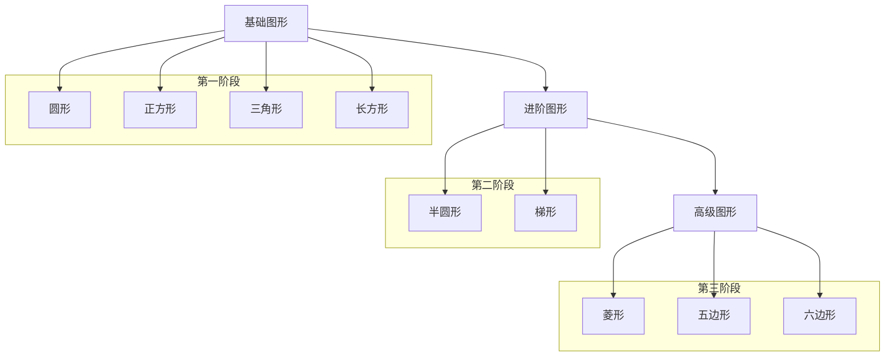

# 3月17日-4月11日-桐桐成长目标

## 语言：
1. 加强孩子2-3字语言的表达清晰度
2. 初步开启3-4字主谓宾短句的表达，有模糊的代词概念。
3. 正确认识"两步指令"，如："你可以把苹果和香蕉拿给我吗？"孩子可做到。

## 认知：
1. 能清晰认识1-10数字，并能快速指出。
2. 有1-5的数量概念，能识别出1-5个物品数量。
3. 增加10-15个生活物品认知。
4. 认识常见图形
   - 基础图形
     - 圆形
     - 正方形
     - 三角形
     - 长方形
   - 进阶图形
     - 半圆形
     - 梯形
   - 高级图形
     - 菱形
     - 五边形
     - 六边形

## 感统
### 大运动能力提升
- 上楼梯
- 跑步
- 跳跃
- 平衡力

## 生活习惯：
1. 能自己脱衣服，裤子，鞋子
2. 持续大小便训练

## 原则：

### 🎮 游戏时：

#### 基础互动原则
- **眼神交流** 
  - 游戏开始前先引导进行眼神对视
  > "桐桐看着阿姨，桐桐看这是什么"
  - ✨ *目标：直到眼神有对视再开始游戏*

#### 注意力管理
- **分神应对**
  - 可用浮夸的词句吸引注意再继续游戏
  - 如未能吸引注意，可根据孩子的专注事物再进行语言引导
- **专注力培养**
  - 给予适当的独立专注时间
  - 例如：
    - 玩积木时
    - 玩沙子时
  - 💡 *原则：尽量不打扰*

#### 激励机制
- **即时小激励**
  - 完成小任务时：
    - 👐 抱抱
    - 👍 点赞
  - 完成具有挑战性的任务：
    - 🍬 可用小零食奖励

#### 互动活动
- **儿歌唱跳** 🎵
  - 用简单的三首歌曲边唱边跳：
    1. 《baby shark》
    2. 《拍手歌》
    3. 《身体音阶歌》
- **绘本阅读** 📚
  - 选择方式：根据孩子喜好自行选择
  - 表现方式：
    - 夸大的语气
    - 夸大的表情
    - 夸大的动作
  - *特殊情况：* 如孩子喜欢自行翻页，可根据翻到的页面再进行绘读

### 沟通时：
7. 语言沟通无时无刻融入生活情境中，如："看看前方有什么？数一数有几辆小车子"
8. 语言沟通注意由浅入深，由短渐长，先加强动词+词语，"如：拿玩具，切苹果"再教短句（主谓宾），如"我吃饭，我要熊熊"
9. 注意及时纠正不正确/不清晰发音
10. 在引导认识事物时，先给予2-3秒孩子自主说出词汇，如不能说出再补充。

### 日常生活：
1. 能让小孩自己完成的尽量自己完成，如小孩遇到困难可询问是否需要协助。
2. 不主动抱小孩，如小孩非疲惫情况下请求"抱抱"，可用延迟满足来给予鼓励。