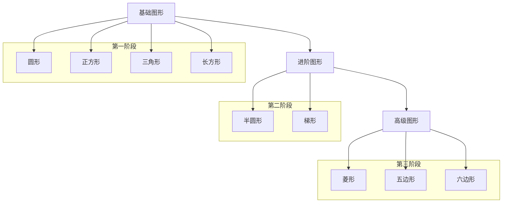

# 3月17日-4月11日-桐桐成长目标

## 语言：
1. 加强孩子2-3字语言的表达清晰度
2. 初步开启3-4字主谓宾短句的表达，有模糊的代词概念。
3. 正确认识"两步指令"，如："你可以把苹果和香蕉拿给我吗？"孩子可做到。

## 认知：
1. 能清晰认识1-10数字，并能快速指出。
2. 有1-5的数量概念，能识别出1-5个物品数量。
3. 增加10-15个生活物品认知。
4. 认识常见图形
   - 基础图形
     - 圆形
     - 正方形
     - 三角形
     - 长方形
   - 进阶图形
     - 半圆形
     - 梯形
   - 高级图形
     - 菱形
     - 五边形
     - 六边形

## 感统
### 大运动能力提升
- 上楼梯
- 跑步
- 跳跃
- 平衡力

## 生活习惯：
1. 能自己脱衣服，裤子，鞋子
2. 持续大小便训练

## 原则：

### 🎮 游戏时：

#### 基础互动原则
- **眼神交流** 
  - 游戏开始前先引导进行眼神对视
  > "桐桐看着阿姨，桐桐看这是什么"
  - ✨ *目标：直到眼神有对视再开始游戏*

#### 注意力管理
- **分神应对**
  - 可用浮夸的词句吸引注意再继续游戏
  - 如未能吸引注意，可根据孩子的专注事物再进行语言引导
- **专注力培养**
  - 给予适当的独立专注时间
  - 例如：
    - 玩积木时
    - 玩沙子时
  - 💡 *原则：尽量不打扰*

#### 激励机制
- **即时小激励**
  - 完成小任务时：
    - 👐 抱抱
    - 👍 点赞
  - 完成具有挑战性的任务：
    - 🍬 可用小零食奖励

#### 互动活动
- **儿歌唱跳** 🎵
  - 用简单的三首歌曲边唱边跳：
    1. 《baby shark》
    2. 《拍手歌》
    3. 《身体音阶歌》
- **绘本阅读** 📚
  - 选择方式：根据孩子喜好自行选择
  - 表现方式：
    - 夸大的语气
    - 夸大的表情
    - 夸大的动作
  - *特殊情况：* 如孩子喜欢自行翻页，可根据翻到的页面再进行绘读

### 沟通时
#### 语言引导原则
- **情境融入**：将语言沟通融入日常场景
  > "看看前方有什么？"
  > "数一数有几辆小车子"

- **循序渐进**：
  1. 先加强**动词+名词**组合
     > "拿玩具
     > "切苹果"
  
  2. 再教导**主谓宾**短句
     > "我吃饭"
     > "我要熊熊"

- **发音指导**：
  - 及时纠正 **不正确/不清晰** 发音
  - 给予2-3秒自主表达时间，需要时再补充

### 日常生活
#### 自主能力培养
- **鼓励自主完成**
  - 穿衣服：引导自己套袖子、扣纽扣
  - 吃饭：让孩子自己尝试使用筷子，熟练使用勺子
  - 收拾玩具：指导分类放回原处
  > 🔑 *关键提示：先观察孩子尝试，遇困难时再询问"需要帮忙吗？"*

#### 情绪管理与界限
- **适度延迟满足**
  - 非必要时不立即满足孩子
  > "桐桐先把积木收好，阿姨再抱抱"
  > "等我们读完这页书，就来抱抱"
  
- **合理设置规则**
  - 睡前例行：洗手→刷牙→听故事→睡觉
  - 用餐规则：坐好→说"开饭了"→吃饭→说"我吃好了"
  > 💡 *原则：规则简单明确，执行坚定一致*

#### 安全意识培养
- **日常提醒**
  - 上下楼梯时扶扶手
  - 热水杯要小心
  - 不能自己开门
  > ⚠️ *方法：用简单语言解释原因，必要时示范正确做法*
